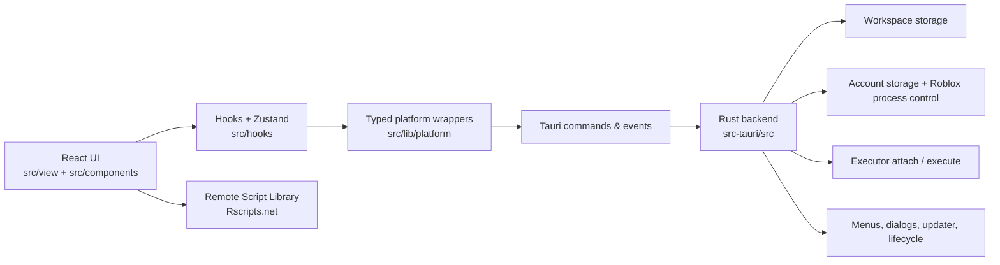

<p align="center">
  
</p>

<p align="center">
  <a href="https://github.com/FrozenProductions/Fumi/actions/workflows/ci.yml">
    
  </a>
  
  <a href="./LICENSE">
    
  </a>
</p>

# Fumi

Fumi is an elegant and soft UI wrapper for MacSploit and Opiumware.

## Current Feature Set

- Workspace editor for local folders with tab creation, rename, duplicate, reorder, archive, restore, delete, and session restore flows
- Luau-focused editing with Ace, completion support, outline panel, execution history, editor search, split panes, and persisted workspace state
- Script Library screen backed by Rscripts.net with search, filters, sorting, favorites, copy-link, copy-script, and add-to-workspace actions
- Accounts screen for saving roblox cookies, resolving Roblox profiles, launching saved accounts, and deleting stored accounts
- Roblox process controls from the desktop shell, including launch, process listing, and kill actions
- Executor integration for attach, detach, reattach, automatic execution, and execute
- Settings for theme, zoom, updater behavior, editor preferences, hotkeys, and archived workspace tabs
- Native Tauri menus, dialogs, clipboard writes, updater flow, opener integration, and desktop window lifecycle handling

## Screens

The current app shell exposes four primary screens:

- `Workspace`
- `Script Library`
- `Accounts`
- `Settings`

Navigation also exists through the command palette and app hotkeys.

## Technology Stack

| Layer                     | Technology                                          | Version / Source      |
| ------------------------- | --------------------------------------------------- | --------------------- |
| Runtime / package manager | Bun                                                 | `bun@1.3.10`          |
| Desktop shell             | Tauri                                               | v2                    |
| Native backend            | Rust                                                | `1.88.0`              |
| Frontend                  | React                                               | `^19.2.4`             |
| Frontend toolchain        | Vite+                                               | `latest`              |
| Vite-compatible core      | `@voidzero-dev/vite-plus-core` via `vite` alias     | `latest`              |
| Language                  | TypeScript                                          | `^6.0.2`              |
| Styling                   | Tailwind CSS                                        | `^3.4.16`             |
| Formatting / linting      | Biome                                               | `^2.0.6`              |
| State management          | Zustand                                             | `^5.0.12`             |
| Editor                    | Ace / React Ace                                     | `^1.43.4` / `^14.0.1` |
| DnD                       | `@dnd-kit/react`                                    | `^0.3.2`              |
| Hotkeys                   | `@tanstack/react-hotkeys`                           | `^0.4.2`              |
| Native plugins            | Clipboard Manager, Dialog, Opener, Process, Updater | Tauri v2 plugins      |

## Architecture

Fumi is split into a React frontend and a Rust/Tauri backend with typed platform wrappers between them.



### Frontend Areas

- `src/view/` contains the app entrypoint, shell composition, and screen switching
- `src/components/` contains reusable UI for the app shell, workspace, script library, accounts, and settings
- `src/hooks/` contains the main app, workspace, script library, tooltip, and accounts flows
- `src/lib/platform/` is the boundary for Tauri APIs and plugin-backed desktop operations
- `src/lib/luau/`, `src/lib/workspace/`, `src/lib/scriptLibrary/`, and `src/lib/accounts/` contain domain logic and parsing

### Backend Areas

- `src-tauri/src/workspace/` handles workspace bootstrap, file operations, persistence, and archived-tab flows
- `src-tauri/src/accounts/` handles saved account operations, Roblox cookie/profile handling, and Roblox process control
- `src-tauri/src/executor/` handles executor status, attach/detach, execute, and related settings
- `src-tauri/src/luau/` handles Luau analysis commands
- `src-tauri/src/menu.rs`, `src-tauri/src/lifecycle.rs`, `src-tauri/src/dialog.rs`, and `src-tauri/src/state.rs` handle native shell behavior

## Prerequisites

- macOS
- Xcode Command Line Tools
- Node.js `>=20.19.0`
- Bun `>=1.3.10`
- Rust `1.88.0`

## Development

Install dependencies:

```bash
bun install
```

Run the full desktop app:

```bash
bun run dev
```

Run only the frontend:

```bash
bun run dev:web
```

Build frontend assets:

```bash
bun run build:web
```

Build the desktop app:

```bash
bun run build
```

Run tests:

```bash
bun run test
```

Run type checks:

```bash
bun run typecheck
```

Run Biome checks:

```bash
bun run lint
```

Apply formatting:

```bash
bun run format
```

## Repository Layout

```text
.
|-- .github/workflows/      # CI and publish workflows
|-- resources/              # Branding assets and repo-specific docs
|-- src/
|   |-- assets/             # Bundled frontend assets
|   |-- components/         # Reusable React UI
|   |-- constants/          # Domain constants
|   |-- contexts/           # React providers
|   |-- hooks/              # App and feature hooks
|   |-- lib/                # Domain logic and platform wrappers
|   `-- view/               # Frontend entrypoint and app shell
|-- src-tauri/
|   |-- capabilities/       # Tauri capability definitions
|   |-- icons/              # App icons
|   |-- src/                # Rust backend
|   |-- Cargo.toml
|   `-- tauri.conf.json
|-- biome.json
|-- package.json
`-- vite.config.mts
```

## Testing And CI

Current validation is driven by `package.json` scripts and GitHub Actions.

- `bun run test` runs `vp test run` and `cargo test --manifest-path src-tauri/Cargo.toml`
- `bun run lint` runs `biome check`
- `bun run typecheck` runs `tsc --noEmit`
- CI runs on pushes to `main` and on pull requests using `.github/workflows/ci.yml`
- CI currently runs install, lint, typecheck, test, and `bun run build:web`

## Releases

- Publishing is handled by `.github/workflows/publish.yml`
- Pushing a tag that matches `app-v*` triggers signed release builds
- The publish workflow builds both `aarch64-apple-darwin` and `x86_64-apple-darwin` targets
- The updater is configured to read from `https://github.com/FrozenProductions/Fumi/releases/latest/download/latest.json`
- Publishing requires `TAURI_SIGNING_PRIVATE_KEY` and `TAURI_SIGNING_PRIVATE_KEY_PASSWORD` GitHub secrets

## Notes For Contributors

- Read [CONTRIBUTING.md](./CONTRIBUTING.md) before opening issues or pull requests

## License

This project is licensed under the [MIT License](./LICENSE).
