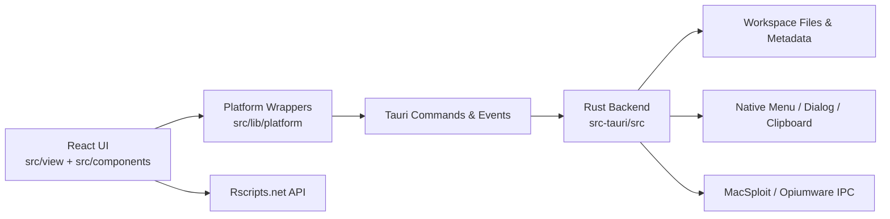

<p align="center">
  
</p>

<p align="center">
  <a href="https://github.com/FrozenProductions/Fumi/actions/workflows/ci.yml">
    
  </a>
  
  <a href="./LICENSE">
    
  </a>
</p>

# Fumi

Fumi is an elegant and soft UI wrapper for MacSploit and Opiumware.

This README is based on the public repository structure and config files such as [package.json](./package.json), [src-tauri/tauri.conf.json](./src-tauri/tauri.conf.json), and [.github/workflows/ci.yml](./.github/workflows/ci.yml).

## Key Features

- Open a local workspace folder and restore its previous session state
- Create, edit, rename, reorder, archive, restore, and delete workspace script tabs
- Edit Luau files in a dedicated workspace editor with completion support
- Browse and search a remote script library powered by Rscripts.net
- Copy script links or full script contents to the clipboard
- Import script-library entries directly into the active workspace
- Attach to a supported local executor and execute the active workspace tab
- Use native desktop menus, dialogs, zoom actions, and clipboard integrations through Tauri

## Technology Stack

Primary stack information comes from [package.json](./package.json) and [src-tauri/tauri.conf.json](./src-tauri/tauri.conf.json).

| Layer                     | Technology                                      | Version             |
| ------------------------- | ----------------------------------------------- | ------------------- |
| Runtime / package manager | Bun                                             | `1.3.10+`           |
| Desktop shell             | Tauri                                           | `v2`                |
| Native backend            | Rust                                            | `1.88.0+`           |
| Frontend                  | React                                           | `19.2.4`            |
| Frontend renderer         | React DOM                                       | `19.2.4`            |
| Build toolchain           | Vite+ (`vite-plus`)                             | `latest`            |
| Vite-compatible core      | `@voidzero-dev/vite-plus-core` via `vite` alias | `latest`            |
| Language                  | TypeScript                                      | `6.0.2`             |
| Styling                   | Tailwind CSS                                    | `3.4.16`            |
| Motion utilities          | `tailwindcss-motion`                            | `1.1.1`             |
| Formatting / linting      | Biome                                           | `2.0.6`             |
| State management          | Zustand                                         | `5.0.12`            |
| Effects / runtime helpers | Effect                                          | `3.21.0`            |
| Hotkeys                   | `@tanstack/react-hotkeys`                       | `0.4.2`             |
| Drag and drop             | `@dnd-kit/react`                                | `0.3.2`             |
| Editor                    | Ace / React Ace                                 | `1.43.4` / `14.0.1` |
| Icons                     | Hugeicons                                       | `4.0.0` / `1.1.6`   |
| Tauri plugins             | Clipboard Manager, Dialog, Process, Updater     | `v2`                |

## Project Architecture

Fumi is split into a React frontend and a Rust/Tauri backend:

- The frontend under [`src/`](./src) is organized around [`src/view`](./src/view), reusable UI in [`src/components`](./src/components), hooks in [`src/hooks`](./src/hooks), and domain helpers in [`src/lib`](./src/lib).
- Frontend access to native capabilities is funneled through wrappers in [`src/lib/platform`](./src/lib/platform) instead of calling raw Tauri APIs throughout the component tree.
- The Rust backend in [`src-tauri/src`](./src-tauri/src) registers Tauri commands, menu events, lifecycle hooks, workspace persistence, updater/plugin setup, and executor behavior for MacSploit and Opiumware.
- The script library is fetched by the frontend, while local workspace operations and executor actions go through the native backend.



### Main Runtime Areas

- [`src/view/App.tsx`](./src/view/App.tsx) composes the app shell, sidebar, topbar, settings window, updater flow, and command palette.
- [`src/view/appScreens.tsx`](./src/view/appScreens.tsx) switches between the workspace and script-library screens.
- [`src-tauri/src/lib.rs`](./src-tauri/src/lib.rs) wires commands, plugins, menu handling, guarded app/window shutdown, and quit preparation.
- [`src-tauri/src/workspace`](./src-tauri/src/workspace) owns workspace metadata, file operations, archive/restore flows, and session restore behavior.
- [`src-tauri/src/executor`](./src-tauri/src/executor) manages executor detection, MacSploit and Opiumware IPC flows, and execution messages.
- [`src-tauri/src/menu.rs`](./src-tauri/src/menu.rs) defines native app, edit, file, view, and window menus.

## Getting Started

### Prerequisites

- macOS
- Xcode Command Line Tools
- Node.js `20.19.0+`
- Bun `1.3.10+`
- Rust `1.88.0+`

### Installation

```bash
bun install
```

### Run In Development

Run the full desktop app:

```bash
bun run dev
```

This starts the Vite dev server and launches the Tauri shell against `http://localhost:5173`.

If you only need the frontend for UI work:

```bash
bun run dev:web
```

### Build

Build only the web assets:

```bash
bun run build:web
```

Build the desktop application bundle:

```bash
bun run build
```

### Available Scripts

```bash
bun run dev        # Start the Tauri desktop app in development
bun run dev:web    # Start only the Vite frontend
bun run build:web  # Build frontend assets
bun run build      # Build the Tauri desktop bundle
bun run test       # Run frontend tests and Rust tests
bun run typecheck  # Run TypeScript type checks
bun run lint       # Run Biome lint/format checks
bun run format     # Apply Biome formatting
```

### Desktop Shell vs Web-Only Mode

Works in `bun run dev:web`:

- Most React UI development
- Styling and layout work
- Script-library browsing over standard `fetch()`

Requires the Tauri desktop shell:

- Opening a workspace directory from the OS
- Reading and writing workspace files
- Persisting workspace state through Rust commands
- Native dialogs, menus, zoom events, and clipboard integration
- MacSploit and Opiumware attach and execute flows

## Project Structure

```text
.
|-- .github/
|   `-- workflows/         # CI workflow definitions
|-- resources/             # Branding assets
|-- src/
|   |-- assets/            # Bundled frontend assets
|   |-- components/        # Reusable React UI by domain
|   |-- constants/         # Shared constants grouped by feature
|   |-- contexts/          # React providers
|   |-- hooks/             # Reusable hooks by domain
|   |-- lib/               # Helpers, shared domain types, and platform wrappers
|   |-- view/              # Frontend entrypoint and top-level app composition
|-- src-tauri/
|   |-- capabilities/      # Tauri capability permissions
|   |-- gen/               # Generated Tauri schemas
|   |-- icons/             # Desktop app icons
|   |-- src/               # Rust backend, commands, menu, events, state
|   `-- tauri.conf.json    # Tauri app, bundle, and dev/build configuration
|-- biome.json
|-- LICENSE
|-- package.json
|-- tailwind.config.js
`-- vite.config.mts
```

## Development Workflow

The documented workflow is repo-driven rather than process-heavy:

- Install dependencies with `bun install`.
- Use `bun run dev` for full desktop development or `bun run dev:web` for frontend-only work.
- Keep Tauri API access behind wrappers in [`src/lib/platform`](./src/lib/platform).
- Update [`src-tauri/tauri.conf.json`](./src-tauri/tauri.conf.json) when app metadata, windows, permissions, or bundle settings change.
- Update [`src-tauri/capabilities`](./src-tauri/capabilities) when new frontend Tauri APIs need extra permissions.
- For runtime wiring or cross-process changes, run `bun run lint`, `bun run typecheck`, and `bun run build`.

### CI

The repository includes a macOS CI workflow in [.github/workflows/ci.yml](./.github/workflows/ci.yml) that runs on pushes to `main` and on pull requests. It performs:

- `bun install --frozen-lockfile`
- `bun run lint`
- `bun run typecheck`
- `bun run test`
- `bun run build:web`

### Release Automation

- GitHub Releases are published by [.github/workflows/publish.yml](./.github/workflows/publish.yml) when you push a tag matching `app-v*`, for example `app-v1.0.1`.
- The release workflow builds both macOS updater targets used by Fumi and uploads the signed updater artifacts, including `latest.json`, to the GitHub Release.
- The updater endpoint configured in [`src-tauri/tauri.conf.json`](./src-tauri/tauri.conf.json) reads from `https://github.com/FrozenProductions/Fumi/releases/latest/download/latest.json`.

### Updater Signing Setup

- A Tauri updater keypair has to exist before publishing releases.
- Store the private key contents in the GitHub secret `TAURI_SIGNING_PRIVATE_KEY`.
- Store the private key password in the GitHub secret `TAURI_SIGNING_PRIVATE_KEY_PASSWORD`.
- The public key is committed in [`src-tauri/tauri.conf.json`](./src-tauri/tauri.conf.json) and is safe to share.

### Branching Strategy

No explicit branching strategy is documented in the repository files currently present. The existing workflow is centered on pull requests plus CI validation.

## Coding Standards

The current codebase follows these conventions:

- Use functional code and keep responsibilities small and explicit.
- Prefer strict TypeScript with precise types and `type` aliases over loose typing.
- Use `import type` for type-only imports.
- Store reusable contracts in domain `*.type.ts` files instead of a central `src/types` folder.
- Keep component prop types in adjacent component `*.type.ts` files when they are shared across that component area.
- Keep React components focused on rendering and push side effects or subscriptions into hooks.
- Avoid derived state in `useEffect`; compute it inline when possible.
- Route frontend-native interactions through [`src/lib/platform`](./src/lib/platform) wrappers.
- Keep reusable constants, types, hooks, and components in their domain folders instead of catch-all files.
- Use Tailwind utilities and the repo’s `fumi` color palette for styling.
- Follow Biome formatting defaults: 4-space indentation and double quotes.

## Testing

The repository currently has both frontend and Rust tests:

- `bun run test` runs `vp test run` and `cargo test --manifest-path src-tauri/Cargo.toml`
- Frontend test files currently live in [`src/lib/app`](./src/lib/app) and [`src/lib/workspace`](./src/lib/workspace)
- CI runs tests together with linting, typechecking, and a frontend production build

## Contributing

If you want to contribute:

1. Install dependencies with `bun install`.
2. Follow the existing project structure and patterns already used in [`src/`](./src) and [`src-tauri/src`](./src-tauri/src).
3. Keep changes targeted and place new code in the appropriate domain folder.
4. Use the scripts in [package.json](./package.json) as the source of truth.
5. Run the relevant validation commands before opening a pull request:

```bash
bun run lint
bun run typecheck
bun run test
bun run build:web
```

For implementation patterns and naming conventions, follow the existing code in [`src/`](./src) and [`src-tauri/src`](./src-tauri/src).

## License

This project is licensed under the [MIT License](./LICENSE).
